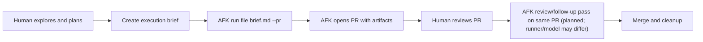

# afk-geoff

AFK orchestration CLI for turning captured requirements into tracked work runs with local artifacts and optional GitHub mirroring.

## Product Direction

AFK is intended to be reused across many repositories, not just this one.
The operating model is:

- human-guided planning up front
- autonomous implementation runs from an execution brief
- pull-request-centric review loops

Now:
- one work item at a time from a brief or mirrored issue
- optional PR publishing (`run file <path> --pr`)
- explicit execution mode resolution before work starts

Next:
- configurable runner/model selection (including separate implementation vs review defaults)
- PR review follow-up pass that can run on the existing PR branch

Later:
- remote execution backends and broader source/publisher adapters

## Execution Modes

Execution modes are AFK's formal operator profiles for run posture.

- `brownfield-moderniser` / `refactoring-surgeon`: craftsmanship-oriented modernization and careful structural change
- `incident-responder`: urgent production stabilization
- `debug-investigator`: bug-squashing and root-cause analysis
- `pragmatic-shipper`: delivery-first default when no stronger signal exists

Overlays (`security-gatekeeper`, `performance-tuner`, `accessibility-advocate`) add additional posture constraints without replacing the primary mode.

## Target Workflow



## Quick Start

```bash
git init -b main
pnpm install
pnpm afk init
```

This creates:

- `.afk/config.yaml`
- `.afk/.gitignore`
- `.afk/iteration-loop.md`
- `.afk/state.sqlite`
- `.afk/runs/`
- `.afk/worktrees/`

## Safe First Workflow

Start with one work item at a time and keep the loop human-reviewed:

1. Capture a requirement.
2. Create an execution brief with your preferred planning skill.
3. Run one AFK item with `run file` or inspect queue state with `status` and `show`.
4. Inspect artifacts with `runs` and `logs`.
5. Review the worktree and branch before merging anything.

Suggested command flow:

```bash
pnpm afk capture "Describe a small internal improvement"
pnpm afk run file brief.md --pr
pnpm afk status
pnpm afk show <requirement-id>
pnpm afk runs
pnpm afk logs <run-id>
```

## GitHub-Backed Setup

Once the repo has a GitHub remote:

1. Add an `origin` remote.
2. Export `GH_TOKEN`.
3. Ensure the configured runner auth env vars are set.
4. Run `pnpm afk doctor`.

## Useful Commands

- `pnpm afk doctor`
- `pnpm afk status`
- `pnpm afk show <id>`
- `pnpm afk runs`
- `pnpm afk logs <run-id>`
- `pnpm afk review <work-item-id>`

## Guardrails

- SQLite remains the source of truth.
- GitHub is a mirror and collaboration surface.
- HITL work is not auto-dispatched.
- `result.json` is the authoritative worker result.
- Run artifacts are retained for debugging.

## Developer Docs

- [BDD scenarios](/Users/davidneil/Development/Personal/afk-geoff/docs/bdd/scenarios.md)
- [Ubiquitous language](/Users/davidneil/Development/Personal/afk-geoff/docs/ubiquitous-language.md)
- [Backlog](/Users/davidneil/Development/Personal/afk-geoff/docs/backlog.md)
