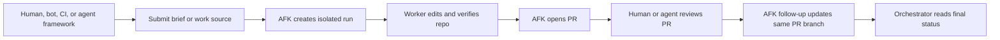

# afk-geoff

AFK Geoff is a boringly reliable execution layer for agentic repo work: it turns briefs from humans or orchestrators into isolated runs, verified changes, pull requests, and follow-up commits.

## Product Direction

AFK is intended to be reused across many repositories and driven by humans, scripts, CI jobs, bots, or higher-level agent frameworks.
The operating model is:

- an orchestrator chooses the work to attempt
- AFK creates an isolated run from a brief or mirrored work source
- the worker produces verified repo changes
- GitHub pull requests become the handoff and review boundary
- follow-up runs address feedback on the existing PR branch

Now:
- one work item at a time from a brief or mirrored issue
- optional PR publishing (`run file <path> --pr`)
- PR review follow-up on the existing PR branch (`follow-up <work-item-id>`)
- explicit execution mode resolution before work starts
- configurable runner/model selection for work and review phases
- bounded autonomous review gate before completion
- machine-readable run events and final results for external orchestrators

Next:
- tighter remote execution and source/publisher adapters

Later:
- explicit backend selection, remote execution backends, and broader source/publisher adapters

## Execution Modes

Execution modes are AFK's formal operator profiles for run posture.

- `brownfield-moderniser` / `refactoring-surgeon`: craftsmanship-oriented modernization and careful structural change
- `incident-responder`: urgent production stabilization
- `debug-investigator`: bug-squashing and root-cause analysis
- `pragmatic-shipper`: delivery-first default when no stronger signal exists

Overlays (`security-gatekeeper`, `performance-tuner`, `accessibility-advocate`) add additional posture constraints without replacing the primary mode.

## Target Workflow



## Quick Start

```bash
git init -b main
corepack pnpm install
pnpm afk init
pnpm afk init --with-github-actions
```

The repository declares its package manager in `package.json`. If `pnpm --version`
does not match that declaration, use `corepack pnpm ...` or `/opt/homebrew/bin/pnpm ...`
so native dependencies such as `better-sqlite3` are installed for the Node version
you actually run.

This creates:

- `.afk/config.yaml`
- `.afk/.gitignore`
- `.afk/iteration-loop.md`
- `.afk/state.sqlite`
- `.afk/runs/`
- `.afk/worktrees/`
- `.github/workflows/afk-run.yml` when `--with-github-actions` is passed

## Local Runner Profiles

For the current prototype, prefer local execution with a CLI agent that is already authenticated on your machine.

Use a credential-free smoke runner first:

```bash
pnpm afk init --runner-profile smoke
git add .afk/config.yaml .afk/smoke-runner.mjs
git commit -m "configure afk smoke runner"
pnpm afk doctor
pnpm afk run file brief.md --json
```

The smoke profile writes `.afk/smoke-runner.mjs` and configures AFK to call it for both work and review using the `local-process` backend. It makes no repo changes and requires no API keys, so it is the safest way to test AFK as an orchestration substrate.

For a real local agent CLI:

```bash
pnpm afk init --runner-profile claude
pnpm afk doctor
pnpm afk run file brief.md --json
```

```bash
pnpm afk init --runner-profile codex
pnpm afk doctor
pnpm afk run file brief.md --json
```

Local runner profiles set `execution.backend: local-process` and `github.enabled: false`, so `doctor` can pass in a plain local repo without Docker, an `origin` remote, or a GitHub token. The Claude and Codex profiles require the `claude` or `codex` executable to exist on `PATH`, but they do not require API key environment variables by default. That lets AFK use whichever local account/session the CLI already knows about.

Turn GitHub back on in `.afk/config.yaml` when you want source issue comments or PR publishing:

```yaml
github:
  enabled: true
```

Add `runner.requiredEnv` only when you want CI-style non-interactive credential checks.

## Safe First Workflow

Start with one work item at a time and keep the loop human-reviewed while the orchestration contract stabilizes:

1. Capture a requirement.
2. Create an execution brief with your preferred planning skill.
3. Run one AFK item with `run file` or inspect queue state with `status` and `show`.
4. Inspect artifacts with `runs` and `logs`.
5. Review the worktree and branch before merging anything.

Suggested command flow:

```bash
pnpm afk capture "Describe a small internal improvement"
pnpm afk run file brief.md --pr
pnpm afk status
pnpm afk show <requirement-id>
pnpm afk runs
pnpm afk logs <run-id>
pnpm afk follow-up <work-item-id>
```

## Orchestrator Contract

The CLI is the first stable control surface for other tools. Long term, commands should be easy for external orchestrators to call without scraping human-readable logs.

For the full agent-facing protocol, see [docs/orchestrator-contract.md](docs/orchestrator-contract.md).

Priority command contracts:

- `afk doctor --json`
- `afk submit issue <github-issue-url> --backend github-actions --json`
- `afk remote-runs --json`
- `afk remote-artifacts <github-actions-run-id> --json`
- `afk remote-download <github-actions-artifact-id> --json`
- `afk run file <path> --pr --json`
- `afk status <work-item-id> --json`
- `afk follow-up <work-item-id> --json`
- `afk runs --json`

Current JSON support covers those commands so harnesses can capture preflight checks, ids, statuses, branch names, worktree paths, PR URLs, and structured error messages directly. Most JSON commands emit one JSON payload on stdout.

`afk run --json` is intentionally NDJSON: it streams one compact JSON object per lifecycle event, then emits a final `kind: "run_result"` object as the last line. That lets a Slack bot, scheduler, CI job, or higher-level agent framework update its own status without waiting for the worker to finish.

Example event stream:

```json
{"kind":"run_event","event":"run_started","runId":"run_...","workItemId":"wi_..."}
{"kind":"run_event","event":"worker_started","iteration":1,"phase":"work"}
{"kind":"run_event","event":"review_issues","iteration":1,"issueCount":2}
{"kind":"run_event","event":"fix_started","iteration":2,"phase":"fix"}
{"kind":"run_event","event":"run_completed","status":"done","finalResultPath":".afk/runs/run_.../final-result.json"}
{"kind":"run_result","command":"run","ok":true,"runId":"run_...","status":"completed"}
```

`doctor`, `run`, and `follow-up` payloads include `ok: true` on success and `ok: false` with failure details before exiting nonzero on failure. Each local run also writes `.afk/runs/<run-id>/progress.json`, which includes the current phase, iteration, elapsed seconds, command/log paths, worktree status, and latest event for polling orchestrators.

`final-result.json` includes `publishable` and `whyNotPublishable`. A local run is only publishable when wrapper verification passed, the review gate passed, there is a committed diff against the base branch, and the worktree is clean. Failed wrapper verification is fed back into the autonomous fix loop even if the reviewer returns `PASS`; if the loop cannot clear it, AFK reports `blocked` rather than `done`.

Execution backend selection is explicit on run commands:

- `afk run file <path> --backend local-docker`
- `afk run file <path> --backend local-process`
- `afk follow-up <work-item-id> --backend local-docker`
- `afk follow-up <work-item-id> --backend local-process`

## GitHub-Backed Setup

Once the repo has a GitHub remote:

1. Add an `origin` remote.
2. Export `GH_TOKEN`.
3. Ensure the configured runner auth env vars are set.
4. Run `pnpm afk init --with-github-actions` to install the workflow harness.
5. Run `pnpm afk doctor`.

## GitHub Actions Harness

The repository includes an experimental manual workflow, `AFK Run`, for external orchestrators that want a remote "issue URL in, PR out" entry point.

Install it in a target repo with:

```bash
pnpm afk init --with-github-actions
```

If `.afk/config.yaml` already exists, this command only adds `.github/workflows/afk-run.yml`. It refuses to overwrite an existing workflow unless `--force-github-actions` is passed.

The workflow checks the target repo out into `target/`, checks AFK Geoff out into `afk-geoff/`, installs AFK's dependencies, and invokes that checkout's CLI against the target repo. Override the AFK source at dispatch time with `--afk-repository` and `--afk-ref` when testing a branch.

For a local prototype before packaging is formalized, you can run this checkout's bin directly from another repo:

```bash
"/absolute/path/to/AFK Geoff/packages/cli/bin/afk.js" init --with-github-actions
```

Required repository secrets:

- `ANTHROPIC_API_KEY` or `CLAUDE_CODE_OAUTH_TOKEN`, depending on the configured runner auth

Dispatch inputs:

- `issue_url`: GitHub issue URL containing an AFK execution brief
- `backend`: currently `local-docker`
- `require_pr`: whether the run must publish a pull request
- `afk_repository`: AFK Geoff repository to check out for the worker CLI
- `afk_ref`: AFK Geoff branch, tag, or SHA to check out

Workflow artifacts:

- `afk-doctor.json`: structured preflight result
- `afk-result.json`: structured run result or failure payload

External orchestrators can trigger that workflow through the CLI:

```bash
pnpm afk submit issue <github-issue-url> --backend github-actions --json
pnpm afk submit issue <github-issue-url> --backend github-actions --afk-ref <branch-or-sha> --json
pnpm afk remote-runs --json
pnpm afk remote-artifacts <github-actions-run-id> --json
pnpm afk remote-download <github-actions-artifact-id> --json
```

## Useful Commands

- `pnpm afk doctor`
- `pnpm afk status`
- `pnpm afk show <id>`
- `pnpm afk runs`
- `pnpm afk logs <run-id>`
- `pnpm afk review <work-item-id>`
- `pnpm afk follow-up <work-item-id>`
- `pnpm afk watch <run-id>`
- `pnpm afk cleanup`

## Guardrails

- SQLite remains the source of truth.
- GitHub is a mirror and collaboration surface.
- HITL work is not auto-dispatched.
- `result.json` is the authoritative worker result.
- Run artifacts are retained for debugging.

## Developer Docs

- [BDD scenarios](docs/bdd/scenarios.md)
- [Ubiquitous language](docs/ubiquitous-language.md)
- [Backlog](docs/backlog.md)
