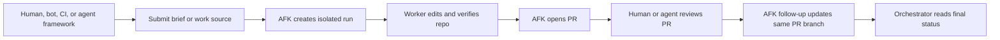

# afk-geoff

AFK Geoff is a boringly reliable execution layer for agentic repo work: it turns briefs from humans or orchestrators into isolated runs, verified changes, pull requests, and follow-up commits.

## Product Direction

AFK is intended to be reused across many repositories and driven by humans, scripts, CI jobs, bots, or higher-level agent frameworks.
The operating model is:

- an orchestrator chooses the work to attempt
- AFK creates an isolated run from a brief or mirrored work source
- the worker produces verified repo changes
- GitHub pull requests become the handoff and review boundary
- follow-up runs address feedback on the existing PR branch

Now:
- one work item at a time from a brief or mirrored issue
- optional PR publishing (`run file <path> --pr`)
- PR review follow-up on the existing PR branch (`follow-up <work-item-id>`)
- explicit execution mode resolution before work starts
- configurable runner/model selection for work and review phases
- bounded autonomous review gate before completion

Next:
- machine-readable command output for external orchestrators

Later:
- explicit backend selection, remote execution backends, and broader source/publisher adapters

## Execution Modes

Execution modes are AFK's formal operator profiles for run posture.

- `brownfield-moderniser` / `refactoring-surgeon`: craftsmanship-oriented modernization and careful structural change
- `incident-responder`: urgent production stabilization
- `debug-investigator`: bug-squashing and root-cause analysis
- `pragmatic-shipper`: delivery-first default when no stronger signal exists

Overlays (`security-gatekeeper`, `performance-tuner`, `accessibility-advocate`) add additional posture constraints without replacing the primary mode.

## Target Workflow



## Quick Start

```bash
git init -b main
pnpm install
pnpm afk init
```

This creates:

- `.afk/config.yaml`
- `.afk/.gitignore`
- `.afk/iteration-loop.md`
- `.afk/state.sqlite`
- `.afk/runs/`
- `.afk/worktrees/`

## Safe First Workflow

Start with one work item at a time and keep the loop human-reviewed while the orchestration contract stabilizes:

1. Capture a requirement.
2. Create an execution brief with your preferred planning skill.
3. Run one AFK item with `run file` or inspect queue state with `status` and `show`.
4. Inspect artifacts with `runs` and `logs`.
5. Review the worktree and branch before merging anything.

Suggested command flow:

```bash
pnpm afk capture "Describe a small internal improvement"
pnpm afk run file brief.md --pr
pnpm afk status
pnpm afk show <requirement-id>
pnpm afk runs
pnpm afk logs <run-id>
pnpm afk follow-up <work-item-id>
```

## Orchestrator Contract

The CLI is the first stable control surface for other tools. Long term, commands should be easy for external orchestrators to call without scraping human-readable logs.

Priority command contracts:

- `afk doctor --json`
- `afk submit issue <github-issue-url> --backend github-actions --json`
- `afk remote-runs --json`
- `afk remote-artifacts <github-actions-run-id> --json`
- `afk run file <path> --pr --json`
- `afk status <work-item-id> --json`
- `afk follow-up <work-item-id> --json`
- `afk runs --json`

Current JSON support covers those commands and emits a single JSON payload on stdout so harnesses can capture preflight checks, ids, statuses, branch names, worktree paths, PR URLs, and structured error messages directly. `doctor`, `run`, and `follow-up` payloads include `ok: true` on success and `ok: false` with failure details before exiting nonzero on failure.

Execution backend selection is explicit on run commands:

- `afk run file <path> --backend local-docker`
- `afk follow-up <work-item-id> --backend local-docker`

## GitHub-Backed Setup

Once the repo has a GitHub remote:

1. Add an `origin` remote.
2. Export `GH_TOKEN`.
3. Ensure the configured runner auth env vars are set.
4. Run `pnpm afk doctor`.

## GitHub Actions Harness

The repository includes an experimental manual workflow, `AFK Run`, for external orchestrators that want a remote "issue URL in, PR out" entry point.

Required repository secrets:

- `ANTHROPIC_API_KEY` or `CLAUDE_CODE_OAUTH_TOKEN`, depending on the configured runner auth

Dispatch inputs:

- `issue_url`: GitHub issue URL containing an AFK execution brief
- `backend`: currently `local-docker`
- `require_pr`: whether the run must publish a pull request

Workflow artifacts:

- `afk-doctor.json`: structured preflight result
- `afk-result.json`: structured run result or failure payload

External orchestrators can trigger that workflow through the CLI:

```bash
pnpm afk submit issue <github-issue-url> --backend github-actions --json
pnpm afk remote-runs --json
pnpm afk remote-artifacts <github-actions-run-id> --json
```

## Useful Commands

- `pnpm afk doctor`
- `pnpm afk status`
- `pnpm afk show <id>`
- `pnpm afk runs`
- `pnpm afk logs <run-id>`
- `pnpm afk review <work-item-id>`
- `pnpm afk follow-up <work-item-id>`
- `pnpm afk watch <run-id>`
- `pnpm afk cleanup`

## Guardrails

- SQLite remains the source of truth.
- GitHub is a mirror and collaboration surface.
- HITL work is not auto-dispatched.
- `result.json` is the authoritative worker result.
- Run artifacts are retained for debugging.

## Developer Docs

- [BDD scenarios](docs/bdd/scenarios.md)
- [Ubiquitous language](docs/ubiquitous-language.md)
- [Backlog](docs/backlog.md)
